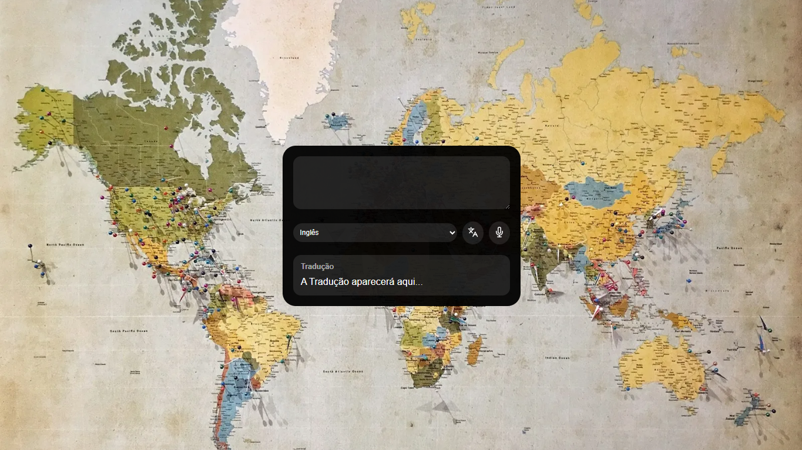
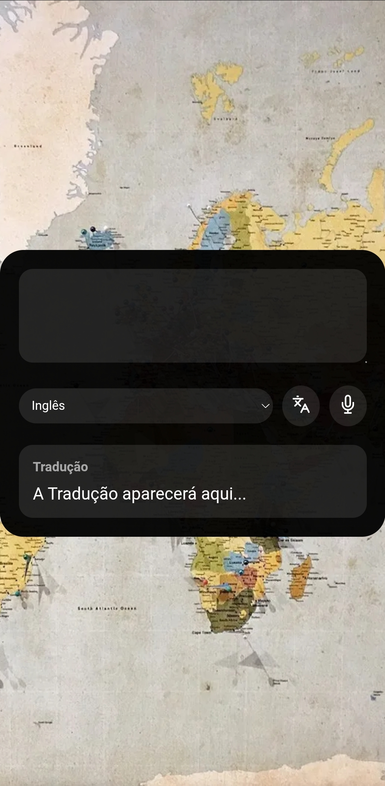

<div align="center">

# 🌍 Tradutor IA

**Traduza textos do português para inglês, alemão ou japonês — com suporte a entrada por voz via Speech Recognition API.**



[](https://tuliovitor.github.io/tradutor-ia)
[](https://developer.mozilla.org/pt-BR/docs/Web/HTML)
[](https://developer.mozilla.org/pt-BR/docs/Web/CSS)
[](https://developer.mozilla.org/pt-BR/docs/Web/JavaScript)

</div>

---

## 📌 Sobre o projeto

O **Tradutor IA** foi desenvolvido durante o evento **"Programação com IA 2026.1"** da DevClub. O evento tem formato ao vivo, o que exige acompanhar e implementar cada etapa em tempo real — com foco em entender a lógica por trás das decisões, não apenas copiar o resultado.

O projeto permite traduzir qualquer texto do português para inglês, alemão ou japonês usando a MyMemory API. Além da entrada por texto, o microfone do dispositivo pode ser usado para ditar o texto diretamente, com tradução automática após a captura da fala — via Web Speech API nativa do browser.

---

## 🎬 Demonstração

| Desktop | Mobile |
|---|---|
|  |  |

---

## ✨ Funcionalidades

- **Tradução via MyMemory API** — envia o texto com `encodeURIComponent` e exibe a tradução retornada por `dados.responseData.translatedText`
- **Seletor de idioma** — três opções (Inglês, Alemão, Japonês) mapeadas para os códigos aceitos pela API (`en`, `de`, `ja`)
- **Estado de loading** — exibe "Traduzindo..." enquanto aguarda a resposta da API, antes de exibir o resultado
- **Tratamento de erro** — `try/catch` captura falhas de rede ou da API e exibe mensagem amigável sem quebrar a interface
- **Entrada por voz** — botão de microfone usa a Web Speech API (`SpeechRecognition`) para capturar fala em `pt-BR` e preencher o textarea
- **Tradução automática pós-fala** — ao capturar o texto falado, `traduzir()` é chamada imediatamente sem precisar de interação adicional
- **Verificação de suporte ao microfone** — antes de criar o objeto `SpeechRecognition`, o código verifica se o browser suporta a API; se não, exibe um `alert` explicativo
- **Feedback visual de gravação** — o botão do microfone fica vermelho enquanto está gravando e retorna à cor original ao parar
- **Toggle de gravação** — clicar no microfone enquanto está gravando para a captura imediatamente via `reconhecimento.stop()`

---

## 🧱 Stack

| Tecnologia | Uso |
|---|---|
| HTML5 semântico | Estrutura com `textarea`, `select`, controles e área de resultado |
| CSS3 | Layout centralizado com mapa como background, glassmorphism dark no container |
| JavaScript vanilla | Fetch à MyMemory API, Speech Recognition e gerenciamento de estado |
| MyMemory API | Tradução gratuita sem autenticação via query string |
| Web Speech API | Reconhecimento de voz nativo do browser, sem biblioteca externa |

---

## 🗂️ Estrutura do projeto

```
tradutor-ia/
├── index.html    # Estrutura: textarea, select de idioma, botões e resultado
├── scripts.js    # Lógica: tradução, Speech Recognition e estados de UI
├── styles.css    # Layout, container glassmorphism e background de mapa
└── assets/
    ├── mapa.webp        # Imagem de fundo do mapa-múndi
    ├── traduzir.svg     # Ícone do botão de tradução
    └── microfone.svg    # Ícone do botão de microfone
```

---

## 🧠 Decisões técnicas

### Mapeamento de idiomas em objeto literal

O `<select>` exibe os nomes em português ("Inglês", "Alemão", "Japonês"), mas a API exige códigos ISO (`en`, `de`, `ja`). Em vez de usar condicionais `if/else` ou `switch`, o mapeamento é feito com um objeto literal usado como dicionário:

```javascript
const codigosIdiomas = {
  "Inglês": "en",
  "Alemão": "de",
  "Japonês": "ja"
};

let codigoIdioma = codigosIdiomas[idiomaSelecionado];
```

Isso significa que adicionar um novo idioma ao projeto é uma mudança em dois lugares apenas: uma nova `<option>` no HTML e uma nova entrada no objeto — sem alterar a lógica da função de tradução.

---

### Verificação de suporte antes de instanciar a Speech Recognition API

A Web Speech API não está disponível em todos os browsers — especialmente em Firefox e Safari com suporte parcial. Antes de tentar criar o objeto, o código verifica explicitamente se a API existe no `window`:

```javascript
if ("webkitSpeechRecognition" in window || "SpeechRecognition" in window) {
  const SpeechRecognition = window.SpeechRecognition || window.webkitSpeechRecognition;
  reconhecimento = new SpeechRecognition();
  // ...
}
```

O operador `||` no segundo passo garante compatibilidade com browsers que ainda usam o prefixo `webkit` (como versões mais antigas do Chrome). Se nenhuma das duas variantes existir, `reconhecimento` permanece `null` e o clique no botão exibe um `alert` — sem erro no console.

---

### Tradução automática pós-captura de fala

Ao capturar o texto falado, o resultado é inserido no textarea e `traduzir()` é chamada imediatamente — o usuário não precisa clicar no botão após falar:

```javascript
reconhecimento.onresult = function (evento) {
  let textoFalado = evento.results[0][0].transcript;
  inputTexto.value = textoFalado;
  traduzir(); // dispara a tradução sem interação adicional
};
```

Isso cria um fluxo de fala → tradução em um único gesto, que é o comportamento esperado em qualquer app de tradução por voz. Separar as duas ações forçaria uma segunda interação desnecessária.

---

### `try/catch` no fetch com feedback de erro no DOM

Em vez de deixar a Promise rejeitada sem tratamento — o que travaria a interface silenciosamente — o `try/catch` garante que qualquer falha de rede ou da API resulte em uma mensagem visível para o usuário:

```javascript
try {
  let resposta = await fetch(endereco);
  let dados = await resposta.json();
  traducaoTexto.textContent = dados.responseData.translatedText;
} catch (erro) {
  traducaoTexto.textContent = "Erro ao traduzir. Tente novamente.";
  console.error("Erro na tradução:", erro);
}
```

O `console.error` preserva o erro completo para debug sem expô-lo ao usuário final — separação entre experiência do usuário e informação técnica do desenvolvedor.

---

## ⚙️ Como usar

1. Acesse o [deploy](https://tuliovitor.github.io/tradutor-ia) ou abra o `index.html` localmente
2. Digite ou cole um texto em português no campo de entrada
3. Selecione o idioma de destino (Inglês, Alemão ou Japonês)
4. Clique no botão de tradução ou use o microfone para ditar
5. A tradução aparece automaticamente na área de resultado

---

## 📈 Processo de desenvolvimento

| Etapa | O que foi feito |
|---|---|
| 01 | Estrutura HTML com textarea, select, botões e área de resultado |
| 02 | Layout CSS com mapa como background e container glassmorphism |
| 03 | Objeto de mapeamento de idiomas para códigos da API |
| 04 | Integração com MyMemory API via `fetch` e `encodeURIComponent` |
| 05 | Estados de UI: loading ("Traduzindo...") e erro com `try/catch` |
| 06 | Speech Recognition com verificação de suporte e prefixo `webkit` |
| 07 | Toggle de gravação com feedback visual vermelho no botão |
| 08 | Tradução automática após captura da fala |

---

## 💡 O que eu aprenderia diferente

- Teria adicionado suporte a **mais idiomas** desde o início usando a estrutura de objeto já existente — o mapeamento atual facilita a extensão, mas o `<select>` foi definido com apenas três opções fixas no HTML sem pensar na escalabilidade visual da lista
- O feedback de gravação é feito via `botaoMicrofone.style.backgroundColor` inline — teria usado uma **classe CSS** (`gravando`) para controlar o estado visual, mantendo toda a aparência no CSS e não misturando estilo com lógica
- Teria explorado o campo `interimResults: true` da Speech Recognition para mostrar o texto sendo transcrito **em tempo real** enquanto o usuário fala, em vez de exibir só o resultado final

---

## 👨‍💻 Autor

**TULIO VITOR**

[](https://linkedin.com/in/tuliovitor)
[](https://github.com/tuliovitor)

---

<div align="center">

Feito com muito ☕ e muito 🌍

</div>
